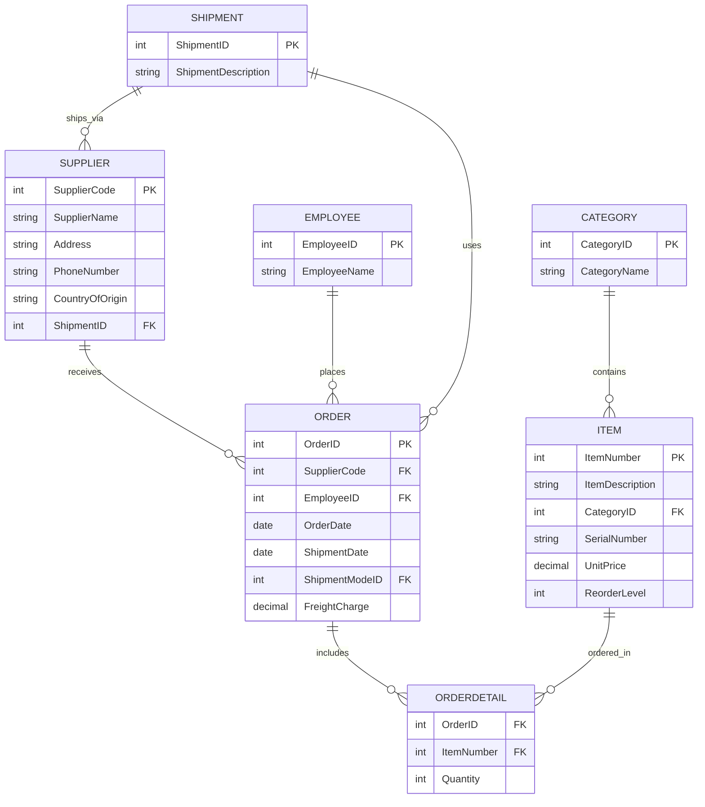

# Case Study 1: Shop Here

## Step 1: Entities

- Categories
- Items
- Suppliers
- Employees
- Purchase Orders

## Step 2: Attributes

**Categories**

- Category Number (PK)
- Category Name

**Items**

- Item Number (PK)
- Item Description
- Category Number (FK → Categories)
- Serial Number
- Unit Price
- Reorder Level

**Suppliers**

- Supplier Code (PK)
- Supplier Name
- Address
- Phone Number
- Country of Origin
- Shipment Mode Number
- Shipment Mode

**Employees**

- Employee ID (PK)
- Employee Name

**Purchase Orders**

- Purchase Order ID (PK)
- Supplier ID (FK → Suppliers)
- Employee ID (FK → Employees)
- Item Number (FK → Items)
- Order Date
- Shipment Date
- Shipment Method ID
- Quantity
- Charge

## Step 3: ER Diagram

