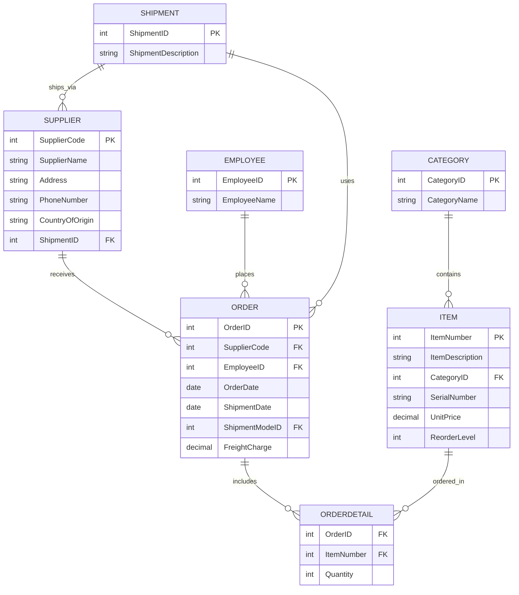

# Case Study 1: Shop Here

## Step 1: Entities

- Categories
- Items
- Suppliers
- Employees
- Purchase Orders

## Step 2: Attributes

**Categories**

- Category Number (PK)
- Category Name

**Items**

- Item Number (PK)
- Item Description
- Category Number (FK → Categories)
- Serial Number
- Unit Price
- Reorder Level

**Suppliers**

- Supplier Code (PK)
- Supplier Name
- Address
- Phone Number
- Country of Origin
- Shipment Mode Number
- Shipment Mode

**Employees**

- Employee ID (PK)
- Employee Name

**Purchase Orders**

- Purchase Order ID (PK)
- Supplier ID (FK → Suppliers)
- Employee ID (FK → Employees)
- Item Number (FK → Items)
- Order Date
- Shipment Date
- Shipment Method ID
- Quantity
- Charge

## Step 3: ER Diagram

```mermaid
erDiagram
    CATEGORY ||--o{ ITEM : contains
    SUPPLIER ||--o{ ORDER : receives
    EMPLOYEE ||--o{ ORDER : places
    SHIPMENT||--o{ ORDER : uses
    SHIPMENT ||--o{ SUPPLIER : ships_via
    ORDER ||--o{ ORDERDETAIL : includes
    ITEM ||--o{ ORDERDETAIL : ordered_in

    CATEGORY {
        int CategoryID PK
        string CategoryName
    }
    ITEM {
        int ItemNumber PK
        string ItemDescription
        int CategoryID FK
        string SerialNumber
        decimal UnitPrice
        int ReorderLevel
    }
    SUPPLIER {
        int SupplierCode PK
        string SupplierName
        string Address
        string PhoneNumber
        string CountryOfOrigin
        int ShipmentID FK
    }
    SHIPMENT {
        int ShipmentID PK
        string ShipmentDescription
    }
    EMPLOYEE {
        int EmployeeID PK
        string EmployeeName
    }
    ORDER {
        int OrderID PK
        int SupplierCode FK
        int EmployeeID FK
        date OrderDate
        date ShipmentDate
        int ShipmentModeID FK
        decimal FreightCharge
    }
    ORDERDETAIL {
        int OrderID FK
        int ItemNumber FK
        int Quantity
    }
```
# 4. Map the ER Diagram to Tables
CATEGORY

## CATEGORY

| Attribute         | Key    |
| ----------------- | ------ |
| `Category_Number` | **PK** |
| `Category_Name`   |        |

## ITEM

| Attribute              | Key    |
| ---------------------- | ------ |
| `Item_Number`          | **PK** |
| `Item_Description`     |        |
| `Item_Category_Number` | **FK** |
| `Serial_Number`        |        |
| `Unit_Price`           |        |
| `Reorder_Level`        |        |

## SUPPLIER

| Attribute              | Key    |
| ---------------------- | ------ |
| `Supplier_Code`        | **PK** |
| `Supplier_Name`        |        |
| `Address`              |        |
| `Phone_Number`         |        |
| `Country_of_Origin`    |        |
| `Shipment_Mode_Number` | **FK** |
| `Shipment_Mode`        |        |

## EMPLOYEE

| Attribute     | Key    |
| ------------- | ------ |
| `Employee_ID` | **PK** |

## PURCHASE_ORDER

| Attribute            | Key    |
| -------------------- | ------ |
| `Purchase_Order_ID`  | **PK** |
| `Supplier_ID`        | **FK** |
| `Employee_ID`        | **FK** |
| `Order_Date`         |        |
| `Shipment_Date`      |        |
| `Quantity`           |        |
| `Shipment_Method_ID` | **FK** |
| `Freight_Charge`     |        |

## SHIPMENT_METHOD

| Attribute            | Key    |
| -------------------- | ------ |
| `Shipment_Method_ID` | **PK** |
| `Shipment_Method`    |        |

## PURCHASE_ORDER_ITEM

| Attribute           | Key        |
| ------------------- | ---------- |
| `Purchase_Order_ID` | **PK, FK** |
| `Item_Number`       | **PK, FK** |
| `Quantity`          |            |

---

# STEP 5. Normalize the Tables to 3NF

Final 3NF Tables
CATEGORY

-------------------------
- Category_Number (PK)
- Category_Name

ITEM
-------------------------
- Item_Number (PK)
- Item_Description
- Item_Category_Number (FK)
- Serial_Number
- Unit_Price
- Reorder_Level

SUPPLIER
-------------------------
- Supplier_Code (PK)
- Supplier_Name
- Address
- Phone_Number
- Country_of_Origin
- Shipment_Mode_Number (FK)

SHIPMENT_MODE
-------------------------
- Shipment_Mode_Number (PK)
- Shipment_Mode

EMPLOYEE
-------------------------
- Employee_ID (PK)

PURCHASE_ORDER
-------------------------
- Purchase_Order_ID (PK)
- Supplier_ID (FK)
- Employee_ID (FK)
- Order_Date
- Shipment_Date
- Quantity
- Shipment_Method_ID (FK)
- Freight_Charge

SHIPMENT_METHOD
-------------------------
- Shipment_Method_ID (PK)
- Shipment_Method

PURCHASE_ORDER_ITEM
-------------------------
- Purchase_Order_ID (PK, FK)
- Item_Number (PK, FK)
- Quantity

## STEP 6. Primary Keys and Foreign Keys

| Table              | Primary Key (PK)    | Foreign Key (FK)                  |
| ------------------ | ------------------- | --------------------------------- |
| **EVENT_TYPE**     | `Event_Type_Code`   | —                                 |
| **EVENT**          | `Event_Code`        | `Event_Type_Code`, `Employee_ID`  |
| **EMPLOYEE**       | `Employee_ID`       | —                                 |
| **ATTENDEE**       | `Attendee_ID`       | —                                 |
| **FEE_SCHEDULE**   | `Fee_Schedule_ID`   | `Event_ID`                        |
| **PAYMENT**        | `Payment_ID`        | `Event_Code`, `Payment_Method_ID` |
| **PAYMENT_METHOD** | `Payment_Method_ID` | —                                 |

``
 
